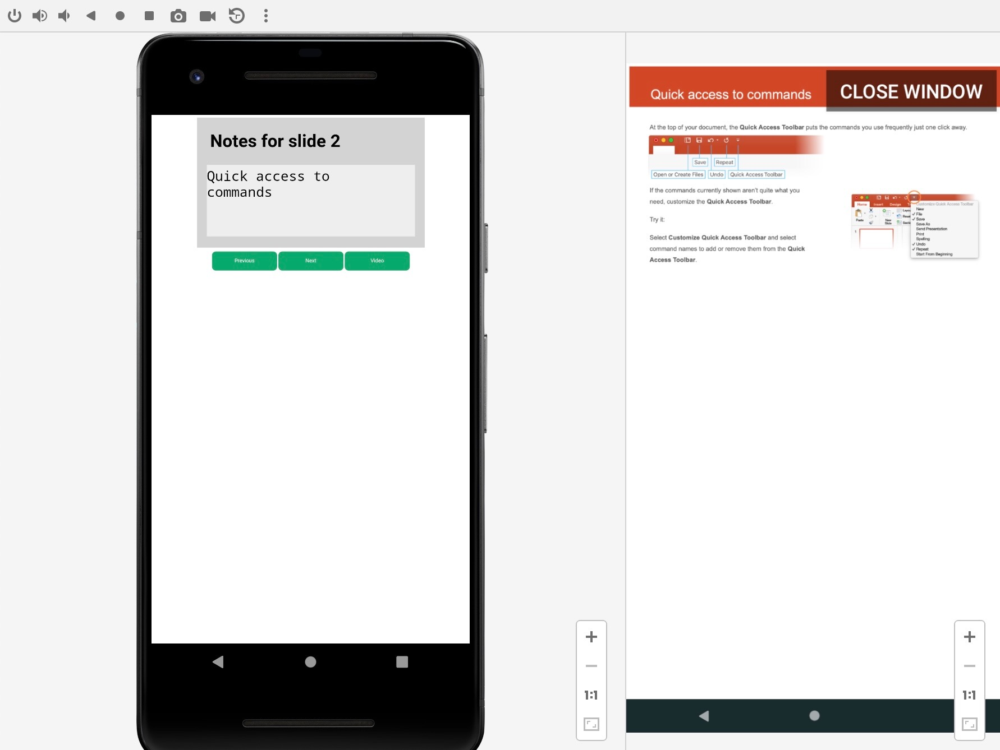

# S57 WebView Multi-Display Demo App 

## Overview

The S57 WebView Multi-Display Demo App is a simple Android application that demonstrates how to
utilize multiple displays efficiently in a WebView application and communicate between the WebView
instances. The application is developed and maintained by S57 Team (https://www.s57.io/).

See the server side implementation here:

https://github.com/s57-dev/webview-multidisplay-html-demo

## Screenshots

## Quick guide

Install Android Studio and the Android SDK. Open the project in Android Studio and run the app on
a multi display device or emulator.

To enable multiple displays in the emulator follow these steps:

1.) In emulator window click the three dots in the bottom right corner (Settings).

2.) Select Displays and Add Secondary Display.

## Bug reports and feature requests

Please submit bug reports and feature requests as GitHub issues here:

https://github.com/s57-dev/webview-multidisplay-android-demo/issues

## Known issues and limitations

TBA
